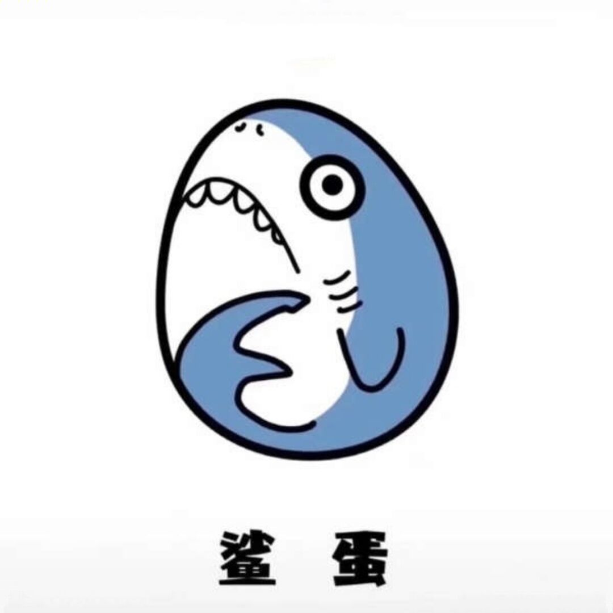

## Big header
#### Small header

[open bilibili](https://www.bilibili.com)

[README2](./README2.md)

## local pic



## online pic


```c++
printf("Hello");
```

> Let life be beautiful like summer flowers and death like autumn leaves.

* cpp
* java

1. cpp
2. java


| number | content |
| ------ | ------- |
| First  | cpp   |
| Second  | java |


**CPP** 

*Java* 

---

___

~~cpp is the greatest language~~


